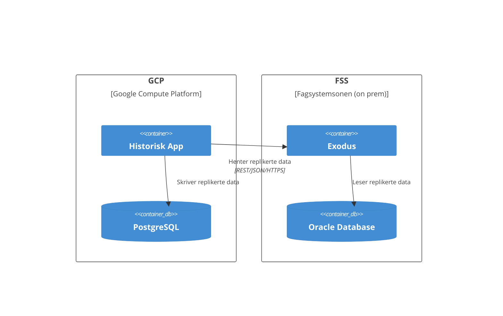
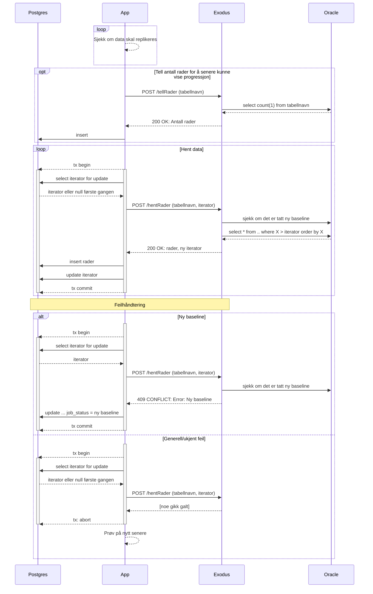

# Familie-ks-exodus - en klon av Historisk Exodus - tilgjengeliggjøring av tabeller for migrering til GCP

orginal: https://github.com/navikt/historisk-exodus

Dette er en applikasjon som gir tilgang til historiske data som opprinnelig kommer fra Infotrygd slik at de kan
replikeres til PostgreSQL i GCP.

**Denne applikasjonen er laget for å lese døde data fra Oracle, dvs. data som ikke forandrer seg.**

For å se hvor denne tjenesten kjøres, se `nais`-mappen.

Nye klienter legges til under `accessPolicy.inbound.rules` i deploymenten.
Tilganger til tabeller ligger som custom roles på hver klient.

## Lokalt utviklingsmiljø

### Relevante endepunkt

- Swagger: http://localhost:8080/swagger-ui/index.html
- Tabeller og kolonner som er i bruk: http://localhost:8080/tables

### Bygg og start utviklingsmiljø

#### Bygg og kjør tester

`mvn clean verify`

#### Kjør backend i debug mode fra IntelliJ
Se `DevMain.kt` i test-mappen

#### Kjør alt med docker compose

```shell
docker compose up
```

## Tekniske krav til Oracle-tabeller som skal replikeres

Følgende tekniske krav må være oppfylt for at Exodus skal kunne replikere en tabell:

- Tabellen må ha en definert primary key. Denne kan bestå av en eller flere kolonner.
- Hver rad må ha et timestamp som viser når den sist ble endret. Denne må ha kolonnenavn `OPPDATERT`.
- Følgende indeks må eksistere: `(OPPDATERT, PK_1, PK_2, ..., PK_n)` hvor `PK_1, PK_2, ..., PK_n` er alle
primary key kolonnene sortert i alfabetisk rekkefølge.

## Arkitektur

Exodus er en tilstandsløs applikasjon som henter data fra Oracle på vegne av 
en klientapplikasjon. Når applikasjonen spør om data fra Exodus så sender
den med et token som inneholder all nødvendig tilstand om hvor langt replikeringen har kommet.
Denne tilstanden genereres av Exodus og lagres av klientapplikasjonen.



### Interaksjon med klientapplikasjon
Diagrammet nedenfor viser hvordan Exodus kommuniserer med klientapplikasjonen og Oracle, 
samt hvordan klientapplikasjonen er forventet å fungere.


